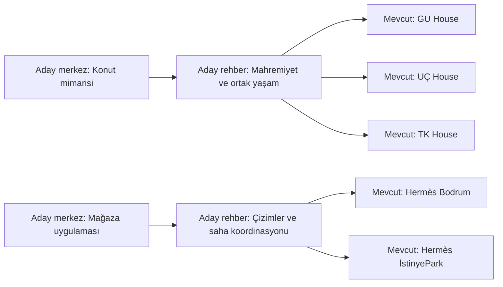

# Faz 4 — Konu grupları ve iç bağlantı önerileri

## Sonuç

Mevcut 36 indekslenebilir sayfa ve 14 projenin iki dildeki açıklamaları incelendi. Konu sınıflandırması, destekleyici içerik boşlukları ve iç bağlantı öneri motoru uygulandı. Sonuçlar `seo-platform` dalında; canlı siteye bağlantı, yazı veya yeni sayfa eklenmedi. Faz 5 başlatılmadı.

- Altı gerçek konu grubu; her dil için altı kayıt, toplam 12 küme.
- Mevcut sayfalar arasında **19 bağlantı önerisi**: 9 TR, 10 EN.
- **20 içerik fırsatı**: dört merkez sayfa ve altı rehber fikrinin iki dilde adayları. Bunlar yazılmış/yayınlanmış içerikler değildir.
- Mevcut yapıda **22 MEDIUM inceleme kaydı**: proje sayfalarında az bağlamsal gelen bağlantı. Kırık bağlantı veya gerçek orphan bulunmadı.
- Döngü oluşturabilecek 16 aday bağlantı elendi. Sayfa başına en fazla iki yeni bağlantı öneriliyor.

İncelenebilir dosyalar: `docs/seo-link-review.md` (okunabilir tablolar ve kaynak kanıtları), `docs/seo-phase4-proposals.json` (tam yapılandırılmış sonuç). İnceleme dosyasındaki proje bağlantıları yerel önizlemeyi açar; `http://127.0.0.1:4322` sunucusu çalışmalıdır.

## Gerçek konu yapısı

| Konu | Projeler | Merkez sayfa kararı |
| --- | --- | --- |
| Konut mimarisi | Hisarönü, TK, UÇ, GU, Haiti sosyal konut | Aday; 5 gerçek proje |
| Mağaza uygulaması ve koordinasyon | Hermès Bodrum, Hermès İstinyePark, Rolex Suadiye | Aday; 3 gerçek proje |
| Ulaşım ve garaj kampüsleri | BBS-1, BBS-2 | Aday; 2 gerçek proje |
| Operasyon tesisleri ve kontrollü dolaşım | Dragon Oil Hazar, GMS Ashgabat | Aday; 2 gerçek proje |
| Kültür ve yeniden işlevlendirme | Hazar Kültür Merkezi | Tek proje; ayrı merkez sayfa önerilmedi |
| SPA ve spor alanları uygulaması | Museum Hotel Antakya SPA | Tek proje; ayrı merkez sayfa önerilmedi |

Hizmet kapsamı kategori adından çıkarılmıyor. Hermès projelerinde marka tarafından sağlanan konseptin yazarlığı ofise atfedilmiyor; gerçek uygulama, shop drawing ve saha koordinasyonu rolleri korunuyor. Yeni merkez sayfanın hizmet sayfası olarak yayınlanması ayrıca gerçek hizmet kapsamının doğrulanmasını gerektirir.

Önerilen hiyerarşi: **merkez sayfa → destekleyici rehber/yazı → mevcut proje örnekleri**. Rehber, karşılaştırma ve açıklama sunmalı; proje metinlerini tekrar eden bir sayfa olmamalı. FAQ yalnızca gerçek faydalı sorular varsa değerlendirilecek; bu fazda FAQ veya schema oluşturulmadı.

Örnek taslak yapı (yalnızca proje sayfaları şu anda yerel çıktıda mevcut):



## Otomatik belirlenen destekleyici içerik boşlukları

Her rehber fikri en az iki gerçek proje açıklamasında kaynak kanıtı gerektirir. Altı konu:

1. Mahremiyet ve ortak yaşam.
2. Yapı, doğal çevre ve açık alan ilişkisi.
3. Mevcut yapı veya mekânın uyarlanması.
4. Malzeme, strüktür ve uygulama detayları.
5. Uygulama çizimleri ve saha koordinasyonu.
6. Dolaşım ve operasyon birimlerinin organizasyonu.

Kaynak URL'ler, bulunan ifadeler ve metin alıntıları her adayda saklanır. Önerilen `/services/` ve `/guides/` adresleri planlama verisidir; canlı URL değildir ve bu adreslere site bağlantısı eklenmedi. Konum sayfaları, genel sürdürülebilirlik iddiaları veya kaynaklarla desteklenmeyen hizmetler üretilmedi.

## İç bağlantı motoru

`scripts/suggest-links.py`, güncel crawler çıktısını analiz eder; `--refresh` ile önce yerel siteyi yeniden tarayabilir. Crawler artık ana metni, bağlantı metnini ve bağlantının bağlamını da kaydeder: içerik, menü, alt bilgi, dil, hiyerarşi ve sonraki proje.

Motor doğrulanmış proje kategorileri, iki dilde açık konu ifadeleri ve aynı dilde TF-IDF/kosinüs benzerliği kullanır. Bu ölçekte 36 sayfa için embedding modeli, LLM, pgvector veya yeni servis gerekli görülmedi. Benzerlik puanı editoryal sıralama içindir; SEO başarı puanı değildir.

- Hedef gerçek, indekslenebilir ve canonical yerel sayfa olmalı.
- Öneriler aynı dilde kalır; kendine ve zaten mevcut hedefe yeni bağlantı önerilmez.
- Aynı proje kategorisi veya en az iki ortak konu, ayrıca asgari benzerlik gerekir.
- İçerik ilişkisi döngü kontrolünden geçer. Menü, dil, geri ve sonraki proje gezinmesi bu tematik grafiğe karıştırılmaz; mevcut gezinme döngüleri değiştirilmez.
- Sayfa başına en fazla iki öneri, hedef için farklı doğal bağlantı metni seçenekleri ve gerçek kaynak/hedef alıntıları vardır.
- Gelen bağlamsal bağlantılar, genel menü bağlantılarından ayrı sayılır. Orphan, az bağlamsal bağlantı ve aşırı içerik bağlantısı tespit edilir; eşikler yerel inceleme kurallarıdır.
- Öneriler `REVIEW` durumundadır; motor HTML, Astro dosyaları, CMS veya yayın kanalına yazmaz.

Örnekler: BBS-1 → BBS-2 (operasyon birimleri), Hermès Bodrum → Hermès İstinyePark (uygulama koordinasyonu), GU → TK/UÇ (mahremiyet ve çevreyle ilişki). Eksiksiz öneri ve alternatif metinler inceleme dosyasında bulunur.

## Yerel veritabanı değişiklikleri

Önceki `.seo/opportunities.sqlite` veritabanına beş yerel analiz tablosu eklendi:

| Tablo | Son kayıt sayısı |
| --- | ---: |
| `topic_pages` | 36 |
| `topic_clusters` | 12 |
| `link_suggestions` | 19 |
| `content_opportunities` | 20 |
| `link_issues` | 22 |

Sabit URL/öneri kimlikleri kullanılır; tekrar çalıştırmalar kayıt çoğaltmaz. Aynı önerinin veritabanındaki inceleme durumu korunur. Aktif kaynaklarda artık bulunmayan öneriler sonuç görüntüsünden çıkarılır. Bu tablo veya durumların hiçbirisi yayınlama eylemi tetiklemez. Mevcut crawler tabloları 37 sayfa ve 1 performans göreviyle korundu. Canlı veri değişikliği yoktur.

## Doğrulama

- Güncel yerel site yeniden tarandı: 36 indekslenebilir sayfa, 370 görsel, HIGH teknik görev yok.
- Sekiz test başarılı: crawler, bağlantı bağlamı, relevance/dil sınırı, mevcut hedeflerin tekrarlanmaması, yeni döngü önleme, orphan/aşırı bağlantı tespiti, tek projeli merkez sayfanın atlanması, eski crawler çıktısının reddi, SQLite tekrar çalıştırma ve inceleme durumunun korunması.
- Öneri motorunun tekrarlı çalıştırmasında JSON özeti ve kayıt sayıları değişmedi.
- Üretim ve önizleme SEO testleri başarılı: 36 sayfa / 328 görsel etiketi.
- Site kaynakları, bağlantıları, görselleri, yayın ayarları, ortam dosyaları ve npm bağımlılık kilidi bu fazda değişmedi. Site derlemesi ve Lighthouse yeniden çalıştırılmadı; Faz 3'ün geçerli çıktısı ve ölçümleri kullanıldı.

## Dosyalar ve yeni bağımlılıklar

Oluşturulanlar: `seo/topic-taxonomy.json`, `scripts/suggest-links.py`, `scripts/tests/test_links.py`, `docs/seo-link-review.md`, `docs/seo-phase4-proposals.json`, bu rapor.

Değişenler: `scripts/crawl-seo.py`, `scripts/tests/test_crawler.py`, `package.json` (yalnızca test/öneri komutları).

Yeni bağımlılık, servis, zamanlanmış görev veya üretim altyapısı yoktur. Python standart kütüphanesi ve mevcut yerel SQLite kullanılır.

## Çalıştırma

Önizleme bir terminalde çalışırken, diğer terminalde:

```text
npm run preview -- --host 127.0.0.1 --port 4322
npm run seo:links -- --refresh --base http://127.0.0.1:4322 --performance-dir .seo/lighthouse
npm run test:crawler
npm run test:links
npm run test:seo
```

Varsayılan çıktılar `.seo/link-proposals.json`, `.seo/link-review.md` ve `.seo/opportunities.sqlite` dosyalarıdır. İnceleme dosyalarını ayrıca üretmek için:

```text
npm run seo:links -- --output docs/seo-phase4-proposals.json --review docs/seo-link-review.md
```

`--taxonomy` ile konu kuralları, `--crawl` ile giriş dosyası, `--db` ile yerel veritabanı seçilebilir. JSON dosyasındaki kategori/tema eşikleri yapılandırılabilir.

Tam AI SEO botu ve onaylı içerik yayın komutu henüz yoktur. Yayın yapılmadı. Gönderilen görev belgesinin “After each phase ... STOP for my approval” kuralına göre Faz 5 için onay beklenir; Faz 5'e geçiş onayı bu bağlantı veya içerik adaylarını otomatik olarak yayınlama izni sayılmaz.
